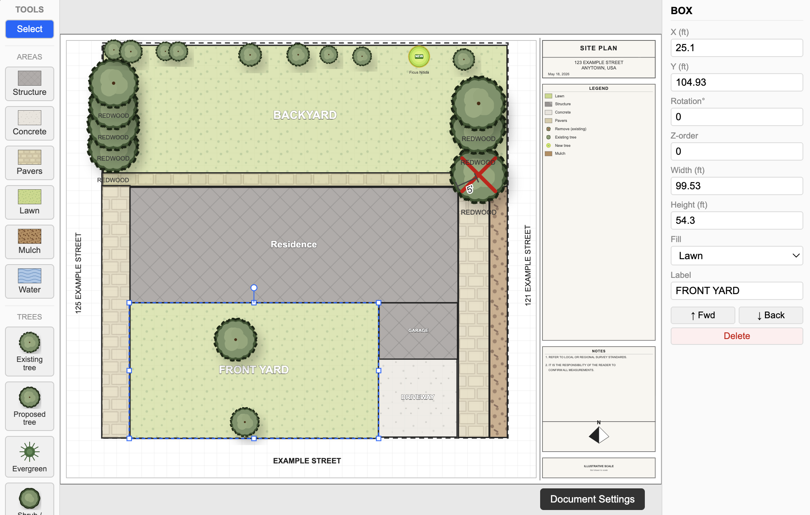

# treeplan

A browser-based site plan drawing tool for landscape and architectural sketches. Draw area fills, place tree symbols, add dimension callouts, and export print-ready PDFs or PNGs with no installation required.



## Features

- **SVG canvas** with pan, zoom, snap-to-grid, and z-order stacking
- **Area tools** for drawing rectangles with fill patterns: Building, Concrete, Paver, Lawn, Mulch, Water
- **Polygon merge** to combine two or more boxes into a freeform poly shape
- **Tree symbols**: Existing, Proposed, Evergreen, Shrub, Ornamental, Removing, New
- **Dimension lines** with editable labels for annotating distances
- **Free text** at any size and weight
- **Plan chrome**: title block, notes list, auto-generated legend, north arrow, scale bar
- **Export** to PNG (configurable DPI) or PDF (jsPDF, sized to canvas paper dimensions)
- **File format**: `.siteplan` JSON files with autosave to localStorage between sessions
- **Full undo/redo** via Zustand + zundo

## Getting Started

```bash
npm install
npm run dev
```

Open [http://localhost:5173](http://localhost:5173).

### Build

```bash
npm run build   # outputs to dist/
npm run preview # serve the production build locally
```

### Tests

```bash
npm test
```

## Keyboard Shortcuts

| Key | Action |
|-----|--------|
| `V` | Select tool |
| `R` | Building area tool |
| `T` | Existing tree tool |
| `X` | Text tool |
| `Escape` | Clear selection, switch to Select |
| `Delete` / `Backspace` | Delete selected elements |
| `Cmd/Ctrl + Z` | Undo |
| `Cmd/Ctrl + Shift + Z` / `Y` | Redo |
| `Cmd/Ctrl + D` | Duplicate selection |
| `Cmd/Ctrl + S` | Save `.siteplan` file |
| `Cmd/Ctrl + E` | Export PNG |
| `Cmd/Ctrl + Shift + E` | Export PDF |
| `Arrow keys` | Nudge selected 1 ft |
| `Shift + Arrow keys` | Nudge selected 10 ft |
| `]` / `[` | Bring forward / send back |

## Project Structure

```
src/
  canvas/          # SVG stage, element views, grid, interactions
  chrome/          # Title block, legend, north arrow, scale bar, notes
  fills/           # SVG fill pattern definitions and registry
  io/              # Save, load, PNG export, PDF export, migrations
  store/           # Zustand document and UI stores
  toolbar/         # Toolbar, inspector panel, text overlay
  trees/           # Tree symbol components and registry
  types/           # TypeScript types for the document schema
```

## Document Format

Plans are saved as `.siteplan` files (JSON, `schemaVersion: 2`). The schema is defined in [src/types/document.ts](src/types/document.ts) and versioned migrations live in [src/io/migrations.ts](src/io/migrations.ts).

## Deployment

Pushes to `main` automatically deploy to GitHub Pages via the workflow in [.github/workflows/deploy.yml](.github/workflows/deploy.yml).
